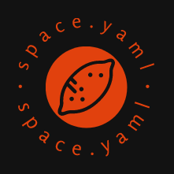
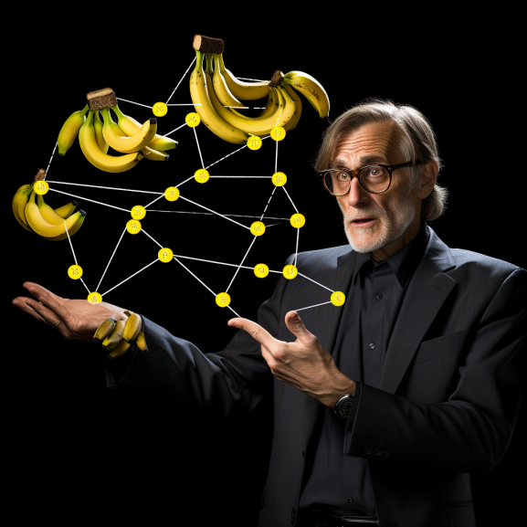

# space.yaml

space.yaml is designed to tackle one of the biggest problems engineers face while trying to build a next-generation 
internal developer platform. That problem is... Whose banana is it?

# The "Whose Banana Problem"

In multi-tenant systems that provide resources to disparate platforms with varying constraints and concerns, it is
important to leverage a technology like space.yaml to take care of the heavy lifting so that developers can focus on 
what is important to them.

# The "T-Shirt Approach"

space.yaml takes an unprecedented approach to problem-solving by incorporating a plethora of modern technologies under
the hood. Technologies are selected based on whether we have collected a convention t-shirt representing that technology
within the past year. This allows us to ensure that every technology has a fair chance at fulfilling our requirements of 
* being modern
* having good marketing and buzzword usage
* having a fair chance at being "competitively redundant"
* financially stable enough to donate swag

Today, space.yaml is built on top of 18 technologies with strong momentum to meet our goal of 20 technologies by the end
of Kubecon 2023.